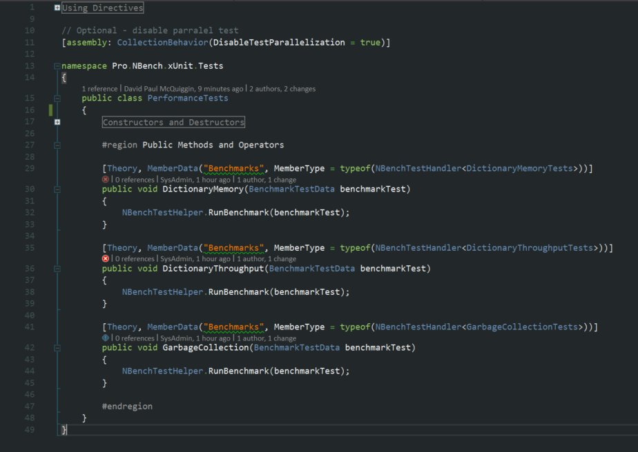
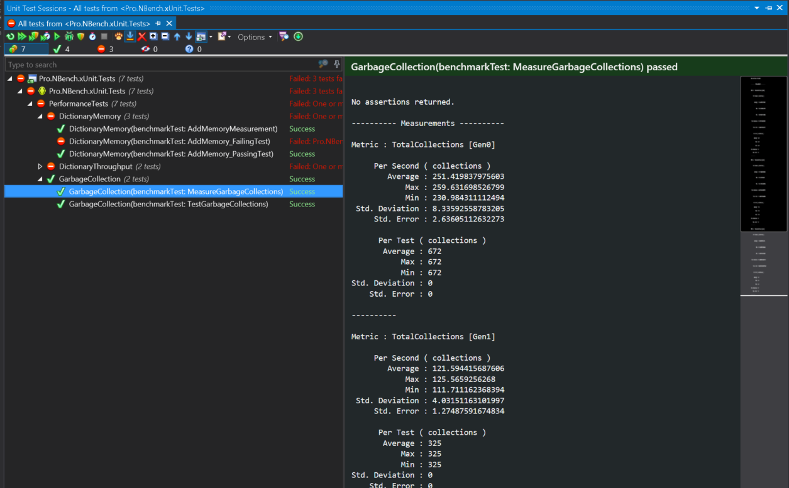

# Pro.NBench.xUnit

Initial, simple approach to allow NBench tests to be discovered, executed, reported, and debugged using xUnit in ReSharper, and to a less polished extent, in Visual Studio Test Explorer.

Heavily influenced by Andrea Angella's approach and article for integrating with NUnit.

http://www.andreaangella.com/2016/03/nbench-performance-testing-nunit-resharper-integration/

##Usage

The Tests project serves as an example, and contains a set of three standard NBench test classes, attributed to collect Measurements, and Assert some conditions.

The example PerformanceTests.cs class contains three straightforward methods, each an xUnit Test attributed to act as a Theory, with a data source specified as a MemberData entry that uses the referenced NBenchTestHandler to discover the NBench Tests contained in one of the aformentioned standard NBench Test Classes. 

The discovered NBench Tests are iterated, and passed to the xUnit Test Method. The body of this method calls a Helper function to execute the NBench benchmarks. Breakpoints in the NBench benchmarks are fully supported for debugging.

When executed using ReSharper, the Tests are displayed, with the result of NBench Assertions, and any Measurements reported by each Test.

Visual Studio Test Explorer will also execute and debug the Tests, but presentation of results is less polished.

Please note, the example includes a variety of passing, and deliberately failing Tests.

##Future plans

a) Release as NuGet package.

b)Possibly the creation of a custom TheoryAttribute, and implementation of IDataDiscoverer, which would support 'Pre-Discovery' of Tests, following a Build.

https://github.com/xunit/xunit/blob/master/src/xunit.core/TheoryAttribute.cs

c) Standard NBench Report output.

d) Collation of results from multiple tests for comparison.

--
**All Feedback Welcome!**

*David Paul McQuiggin, Pro-Coded.*
